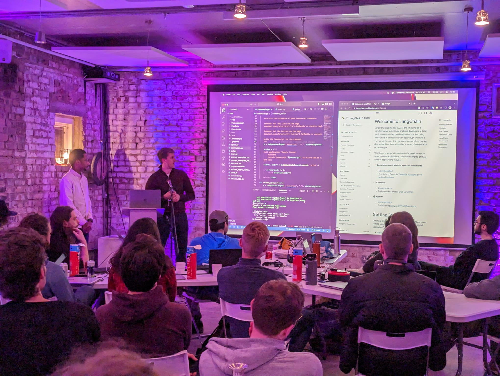

# EA London Hackathon - GPT Automator and LangChain

Yesterday, [Chidi Williams](https://chidiwilliams.com/) and I did the [London EA Hackathon 2023](https://forum.effectivealtruism.org/events/gTSwA8RoGidjpLnf6/london-ea-hackathon) and built a tool to physically control your computer through your voice using Whisper, LangChain and GPT3. It can open and interact with applications, click around in chrome, and synthesize information.

Hackathons are great for trying out new tech - I’ve previously used it to experiment with [tensorflow-js](https://harries.co/#hackathons), [Google Cardboard VR](https://github.com/lharries/mapper), and [Azure’s ML](https://harries.co/#hackathons) apis.

This time we wanted to try out [LangChain](https://github.com/hwchase17/langchain).

## What is LangChain?

LangChain is a is a python package that gives you superpowers when using large language models (LLMs) such as GPT3. It has a number of different modules most notably Chains, Agents and Tools.

Chains enable you to combine multiple components into a pipeline - for example, creating a prompt containing variables and dynamic examples, feeding that into GPT3, taking the result and using that to construct a new prompt for a second LLM. This enables you to use breakdown more complex tasks that wouldn’t otherwise be possible.

**Agents are where the real power comes from**. Instead of you deciding what the specific sequence of the chain should be, you create a set of tools and have the LLM decide which tool it should use next to perform the task.

The tool could be a simple call to GPT3 or a full python script calling external APIs. To create a tool, you write the python script, give the tool a name e.g. “python_repl”, and give a description of when to use the tool (this also acts as the prompt) e.g. “Use this python reply tool when you are wanting to do maths. This tool evaluates python code and returns the result. For example the input ‘5 ^ 5’ returns  3,125”.

By giving the LLM a number of tools and enabling it to decide when to use them, you can overcome the short-comings where LLMs currently fail such as doing complex maths problems.

But **you can also use the tools to go much further**.

LangChain comes with a bunch of tools that enable you to do things like search google, query wikipedia, or interact with SQL database.

But most of the these tools are “read-only”.

## The hackathon

Chidi and I spent the first 30 minutes brainstorming ideas. He had previously built [Buzz](https://github.com/chidiwilliams/buzz), a local speed-to-text program powered by OpenAI’s Whisper. We started wondering how could we combine Buzz and LangChain.

Eventually we landed on the question “What if we the GPT3 could perform actions on our behalf?” - switching the capabilities of the agents from “read-only” to “read-and-write”

In true hackathon fashion, we spend all day hacking and used the final 5 minutes to merge our branches. We gave a presentation on the tool and luckily the demo gods were on our side!



## The result: GPT Automator

In the end we created **GPT Automator**. You speak to your computer and it does tasks on your behalf.

Have a watch of the demo:

[](https://www.loom.com/share/9a1bda3d62d8440e9193a79ff10dd29)

It has two main parts:

1. Voice to command: We generate the command using Whisper running locally (a fork of Buzz).
2. Command to Action: We give the command to a langchain agent equipped with custom tools we wrote. These tools include controlling the operating system of the computer using applescript, and controlling the active browser using javascript. Finally, like any good AI, we have the agent speak out the final result using AppleScript `say "{Result}"` (try typing `say "Hello World!"` into your mac terminal if you haven’t used it before”).

Here's a custom tool we made to have the LLM control the computer using AppleScript:

```python
@tool
def computer_applescript_action(apple_script):
    """
    Use this when you want to execute a command on the computer. The command should be in AppleScript.

    Here are some examples of good AppleScript commands:

    Command: Create a new page in Notion
    AppleScript: tell application "Notion"
        activate
        delay 0.5
        tell application "System Events" to keystroke "n" using {{command down}}
    end tell

    ...

    Write the AppleScript for the Command:
    Command: 
    """
    p = subprocess.Popen(['osascript', '-'], stdin=subprocess.PIPE, stdout=subprocess.PIPE, stderr=subprocess.PIPE)

    stdout, stderr = p.communicate(applescript.encode('utf-8'))

    if p.returncode != 0:
        raise Exception(stderr)

    decoded_text = stdout.decode("utf-8")

    return decoded_text
```

Overall it works surprisingly well!

- “What is 5 x 5?” → It will open a calculator and type in 5 x 5 =
- “Find me a good restaurant nearby” → It will open up chrome, google search for a restaurant nearby, parse the page, and then return the top results. Sometimes it’s cheeky, and instead will open up the google maps result and say “The best restaurants are the ones at the top of the page on Google maps”. Other times it opens the top link on google - and gets stuck on the Google accessibility page…
- “Play chess” → It will open up [Chess.com](http://Chess.com) and start clicking around

Here's what's printed to the terminal as it runs (watch the demo to see it in action):

```
Command: Find a great restaurant near Manchester.

> Entering new AgentExecutor chain...
 I need to search for a restaurant near Manchester.
Action: chrome_open_url
Action Input: https://www.google.com/search?q=restaurant+near+Manchester
Observation:

Thought: I need to read the page
Action: chrome_read_the_page
Action Input: 
Observation: Accessibility links
Skip to main content
... # Shortned for brevity
Dishoom Manchester
4.7
(3.3K) · £££ · Indian
32 Bridge St · Near John Rylands Library
Closes soon ⋅ 11 pm
Stylish eatery for modern Indian fare
San Carlo
4.2
(2.8K) · £££ · Italian
42 King St W · Near John Rylands Library
Closes soon ⋅ 11 pm
Posh, sceney Italian restaurant
Turtle Bay Manchester Northern Quarter
4.7

Thought: I now know the final answer
Final Answer: The 15 best restaurants in Manchester include El Gato Negro, Albert's Schloss, The Refuge, Hawksmoor, On The Hush, Dishoom, Banyan, Zouk Tea Room & Grill, Edison Bar, MyLahore Manchester, Turtle Bay Manchester Northern Quarter, San Carlo, The Black Friar, Mana, and Tast Cuina Catalana.
```

### Tool engineering

“Find me a good restaurant nearby” was particularly tricky. Purely giving it the tool of injecting javascript into the active page resulted in it guessing the dom structure and injecting scripts that referenced elements that didn’t exist e.g. `document.findElementByClassName("star-rating")`. To solve this we gave it a several more opinionated tools: getting the links on the page; clicking on a link, and read the innerText of the page.

I was pleasantly surprised by the agents perseverance, if it ended up in a rabbit hole it’d open a new chrome page and try again.

```python
@tool
def chrome_get_the_links_on_the_page(input):
    """
    Use this when you want to get the links on the current page.

    You should use this before clicking on anything
    """
    return run_javascript('Array.from(document.querySelectorAll("a")).map(x => x.innerText + ": " + x.href).join(" - ")')
```

## Warning! This might wipe your computer

As pointed out by one member of the audience, **use this with caution**! If you ask GPT Automator to wipe your computer it will…

```
tell application "Finder"
  delete every file of entire contents of folder "Macintosh HD"
end tell
```

We didn’t go into this hackathon with a particular EA focus — instead just wanting to trying out LangChain — but ended up spurring some interesting discussions around prompt engineering, alignment, and having your computer wipe your computer by accident.
